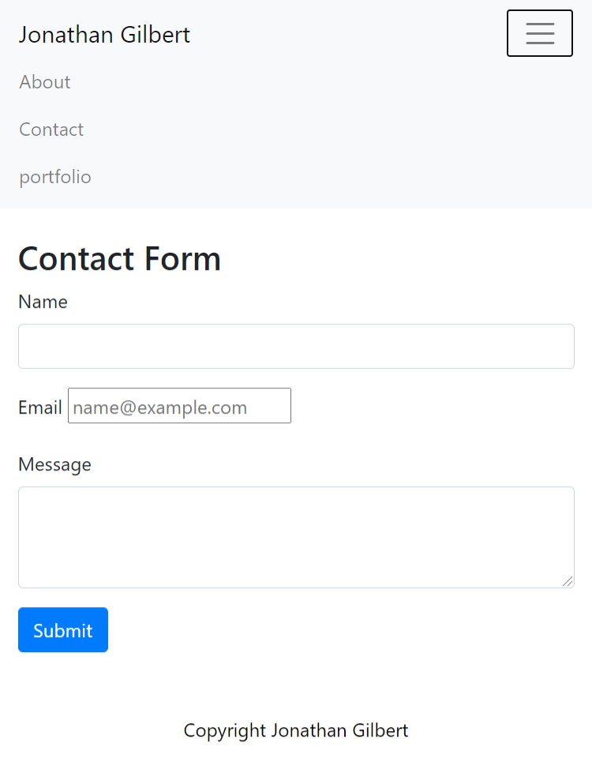

# 02-CSS-and-Bootstrap-RP
02 CSS and Bootstrap with Responsive Portfolio
# Unit 02 CSS and Bootstrap Homework: Responsive Portfolio for Jonathan Gilbert, UNH Coding Boot Camp UNH-POR-FSF-PT-09-2020

#GitHub Repo Link: https://github.com/JGilb28-7/01-HTML-Git-CSS-02-Homework.git

# Website Images:
# 10.8.2020 updated the img links from a \ to a / and removed the "1" after the .png ext was not the act link. 

## Completed Tasks
* Create the following files files: `index.html`, `portfolio.html` and `contact.html`.
    <!-- This complete>
    <!-- added in my photo and added to the Assets folder>
* Using Bootstrap, develop your portfolio site with the following items:
   * A navbar - <!-- Complete>
   * A responsive layout <!--complete>
   * Responsive images <!-- adjusted the Margin using css>

